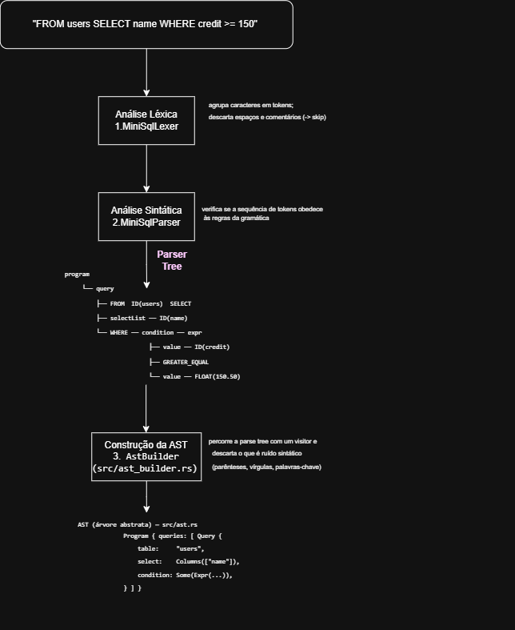

# MiniSQL

Implementação de uma linguagem de consulta baseada em um subconjunto de SQL, desenvolvida para a disciplina de **Compiladores**. A gramática é escrita em ANTLR4 e o analisador é gerado em **Rust**.

Este documento descreve o estado do projeto na **entrega parcial**, que cobre da definição da gramática até a construção da árvore sintática abstrata (AST).

---

## 1. Estado atual

| Etapa | Situação |
|---|---|
| Definição da gramática (`miniSQL.g4`) | concluída |
| Análise léxica | concluída (lexer gerado) |
| Análise sintática | concluída (parser gerado) |
| Construção da AST | concluída (`ast_builder.rs`) |
| Suíte de testes | 59 testes, todos passando |
| Análise semântica / execução | não iniciada |

---

## 2. A linguagem

A MiniSQL adota deliberadamente a **ordem invertida** em relação ao SQL padrão: a tabela é declarada antes das colunas.

```sql
FROM users SELECT name, credit WHERE credit >= 150.50 AND active = TRUE;
```

A motivação é que o leitor (e o analisador) conhece a origem dos dados antes de encontrar os nomes de coluna. Como consequência, uma consulta SQL convencional é **rejeitada** pela linguagem — comportamento verificado pelo teste `test_old_select_syntax`.

### O que é aceito

| Construção | Exemplo |
|---|---|
| Projeção de todas as colunas | `FROM users SELECT *;` |
| Projeção de colunas | `FROM users SELECT name, age;` |
| Comparações | `=` `!=` `<>` `<` `<=` `>` `>=` |
| Conectivos lógicos | `NOT`, `AND`, `OR` |
| Agrupamento | `WHERE NOT (age < 18 OR active = FALSE);` |
| Pertinência | `WHERE type IN ('admin', 'editor');` |
| Literais | inteiro, decimal, negativo, string, booleano |
| Múltiplas consultas | separadas por `;` no mesmo arquivo |
| Comentários | `-- até o fim da linha` |
| Palavras-chave | `SELECT` ou `select` (caixa uniforme) |

### O que não é aceito

Junções entre tabelas, `ORDER BY`, `LIMIT`, `DISTINCT`, apelidos com `AS`, funções de agregação, subconsultas e expressões aritméticas. Identificadores devem começar com letra minúscula (`[a-z] [a-z0-9_]*`).

---

## 3. Arquitetura

O projeto tem dois momentos distintos: a **geração do analisador**, que acontece durante o desenvolvimento, e o **processamento de uma consulta**, que acontece em execução.

### 3.1 Geração do analisador (tempo de desenvolvimento)

```
   grammar/miniSQL.g4          ← ÚNICO artefato escrito à mão nesta etapa
   (regras de lexer + parser)
            │
            │   antlr4-rust-gen --out-dir generated grammar/miniSQL.g4
            ▼
   generated/
     ├── mini_sql_lexer.rs     ← analisador léxico gerado
     ├── mini_sql_parser.rs    ← analisador sintático + visitor gerados
     ├── decisions.json        ← relatório das decisões do parser
     └── semantics.json        ← relatório de predicados semânticos
```

Os arquivos de `generated/` são versionados no repositório para que o projeto compile sem exigir a instalação do gerador. Eles **não devem ser editados à mão**: qualquer alteração se perde na próxima geração. A fonte da verdade é o `.g4`.

### 3.2 Processamento de uma consulta (tempo de execução)



As fases 1 e 2 são **código gerado** pelo ANTLR a partir da gramática. A fase 3 é **escrita à mão**.

Um passo intermediário que o diagrama resume: entre a análise léxica e a sintática existe um fluxo de tokens. Para a consulta `FROM users SELECT name WHERE credit >= 150.50;`, o parser recebe exatamente isto:

```text
[FROM] [ID:users] [SELECT] [ID:name] [WHERE] [ID:credit] [GREATER_EQUAL] [FLOAT:150.50] [END:;] [EOF]
```

Terminada a fase 3, a AST é a entrada da **próxima entrega**: análise semântica e execução.

### 3.3 O que é gerado e o que é nosso

Esta é a divisão mais importante do projeto: **o parser não foi escrito por nós**. O que escrevemos foi a *definição da linguagem*; o algoritmo que reconhece essa linguagem é derivado dela automaticamente.

| Componente | Linhas | Origem |
|---|---|---|
| `grammar/miniSQL.g4` | 102 | escrito à mão |
| `generated/mini_sql_lexer.rs` | 149 | gerado pelo ANTLR |
| `generated/mini_sql_parser.rs` | 2041 | gerado pelo ANTLR |
| `src/ast.rs` | 60 | escrito à mão |
| `src/ast_builder.rs` | 175 | escrito à mão |
| `tests/` | 475 | escrito à mão |

Consequência prática para a suíte de testes: quando um teste falha, o defeito está quase sempre na **gramática** ou na **expectativa do teste** — o ANTLR é infraestrutura de terceiros, com a própria suíte de validação.

---

## 4. Estrutura de arquivos

```text
mini_sql/
├── grammar/
│   └── miniSQL.g4               definição da linguagem (lexer + parser)
│
├── generated/                   código gerado pelo ANTLR — não editar
│   ├── mini_sql_lexer.rs
│   ├── mini_sql_parser.rs
│   ├── decisions.json
│   └── semantics.json
│
├── src/
│   ├── lib.rs                   inclui o código gerado e declara os módulos
│   ├── ast.rs                   tipos da AST
│   ├── ast_builder.rs           parse tree → AST
│   └── main.rs                  binário (ainda vazio)
│
├── tests/
│   ├── parser_success_test.rs   26 testes — consultas válidas
│   ├── parser_error_test.rs     32 testes — consultas inválidas
│   └── ast_test.rs               1 teste  — forma da AST
│
├── Cargo.toml
└── Cargo.lock
```

---

## 5. A gramática

Arquivo: [`mini_sql/grammar/miniSQL.g4`](mini_sql/grammar/miniSQL.g4)

### Regras de parser

```antlr
program     : query+ EOF ;
query       : FROM ID SELECT selectList (WHERE condition)? END ;
selectList  : ID (',' ID)* | STAR ;
condition   : NOT inner=condition                  # not
            | left=condition AND right=condition   # and
            | left=condition OR  right=condition   # or
            | LPAREN inner=condition RPAREN        # parens
            | expr                                 # exprCond
            | expressaoIn                          # inCond
            ;
expr        : left=value op=(EQUAL|NOT_EQUAL|LESS|LESS_EQUAL|GREATER|GREATER_EQUAL) right=value ;
expressaoIn : value IN LPAREN value (COMMA value)* RPAREN ;
value       : ID | INT | FLOAT | STRING | BOOLEAN ;
```

### Decisões de projeto

**Precedência por ordem das alternativas.** A regra `condition` é recursiva à esquerda, e o ANTLR resolve a precedência pela ordem em que as alternativas aparecem: a primeira liga mais forte. Daí `NOT` > `AND` > `OR`, que é a precedência do SQL padrão. Comportamento verificado na prática:

| Entrada | AST resultante |
|---|---|
| `a = 1 OR b = 2 AND c = 3` | `Or(a, And(b, c))` — `AND` liga mais forte |
| `a = 1 AND b = 2 AND c = 3` | `And(And(a, b), c)` — associativo à esquerda |
| `NOT a = 1 AND b = 2` | `And(Not(a), b)` — `NOT` liga mais forte |

**Rótulos de alternativa (`# not`, `# and`, …).** Sem eles, cada nó de condição chegaria ao código Rust como um `ConditionContext` genérico, e descobrir qual alternativa foi usada exigiria procurar tokens dentro do nó. Com os rótulos, o ANTLR gera um tipo distinto por alternativa (`AndLabelContext`, `OrLabelContext`, …) e o `ast_builder` faz correspondência direta.

**`ERROR_CHARACTER : . ;` — tratamento de caractere inválido.** Esta é a última regra do lexer e casa qualquer caractere isolado. Sem ela, um caractere que não pertence a nenhum token — por exemplo o `_` inicial em `FROM _users` — é **descartado silenciosamente** pelo lexer: o parser recebe `FROM users SELECT name;`, uma consulta válida, e a entrada errada produz a **tabela errada sem qualquer erro**. Com a regra, o caractere vira um token que nenhuma regra de parser aceita, e o erro passa a ser reportado com linha e coluna:

```
line 1:5 extraneous input '_' expecting ID
```

A posição no fim do arquivo é obrigatória: o lexer do ANTLR prefere o casamento mais longo e, em empate, a regra declarada primeiro. Como `.` casa exatamente um caractere, ele só vence quando nenhuma outra regra casou.

**Caixa das palavras-chave.** Cada palavra-chave lista explicitamente as duas formas (`SELECT : 'SELECT' | 'select';`). A opção global `caseInsensitive` foi descartada porque ela também tornaria `[a-z]` sensível a maiúsculas, fazendo `Users` ser aceito como identificador válido. O custo dessa escolha é que formas mistas como `Select` não são aceitas.

---

## 6. A AST

Arquivo: [`mini_sql/src/ast.rs`](mini_sql/src/ast.rs)

```rust
pub struct Program  { pub queries: Vec<Query> }

pub struct Query {
    pub table:     String,
    pub select:    SelectList,
    pub condition: Option<Condition>,
}

pub enum SelectList { Columns(Vec<String>), All }

pub enum Condition {
    Not(Box<Condition>),
    And(Box<Condition>, Box<Condition>),
    Or(Box<Condition>, Box<Condition>),
    Parens(Box<Condition>),
    Expr(Expr),
    ExprIn(ExprIn),
}

pub struct Expr   { pub left: Value, pub op: Operator, pub right: Value }
pub struct ExprIn { pub value: Value, pub values: Vec<Value> }

pub enum Value    { Id(String), Int(i64), Float(f64), String(String), Boolean(bool) }
pub enum Operator { Equal, NotEqual, Less, LessEqual, Greater, GreaterEqual }
```

A construção é feita em [`ast_builder.rs`](mini_sql/src/ast_builder.rs), que usa o **visitor** gerado pelo ANTLR para a regra `condition` — cada alternativa rotulada vira um método (`visit_and_label`, `visit_or_label`, …) — e descida recursiva direta sobre os contextos tipados para as demais regras.

### Exemplo real

Saída produzida pelo teste `test_ast_generation` para a consulta

```sql
FROM users SELECT name, credit
WHERE type IN ('admin', 'editor') AND active = TRUE AND credit >= 150.50;
```

```text
Program {
    queries: [
        Query {
            table: "users",
            select: Columns(["name", "credit"]),
            condition: Some(
                And(
                    And(
                        ExprIn(ExprIn {
                            value: Id("type"),
                            values: [String("admin"), String("editor")],
                        }),
                        Expr(Expr { left: Id("active"), op: Equal, right: Boolean(true) }),
                    ),
                    Expr(Expr { left: Id("credit"), op: GreaterEqual, right: Float(150.5) }),
                ),
            ),
        },
    ],
}
```

Repare no aninhamento `And(And(...), ...)`: é a associatividade à esquerda dos conectivos aparecendo na estrutura da árvore.

---

## 7. Testes

59 testes, distribuídos em três arquivos. Cada arquivo vira um executável independente.

| Arquivo | Testes | O que valida |
|---|---|---|
| `parser_success_test.rs` | 26 | consultas válidas são aceitas |
| `parser_error_test.rs` | 32 | consultas inválidas são rejeitadas |
| `ast_test.rs` | 1 | a AST construída tem a estrutura esperada |

A maioria dos casos aparece em par: uma versão com palavras-chave em maiúsculas e outra com o sufixo `_minus`, em minúsculas.

### Critério de aceitação nos testes de erro

Detectar um erro de sintaxe exige mais do que verificar o retorno do parser:

```rust
let result = parser.program();
result.is_err() || parser.number_of_syntax_errors() > 0
```

O motivo é a **recuperação de erro** do ANTLR. Diante de uma entrada malformada, o parser não aborta: ele insere ou descarta tokens para prosseguir e ainda assim devolve `Ok`. Em `form users select ...` (com `FORM` digitado errado), o parser reporta

```
line 1:0 missing FROM at 'form'
line 1:5 extraneous input 'users' expecting SELECT
```

e mesmo assim `program()` retorna `Ok`. Só a consulta ao contador `number_of_syntax_errors()` revela o problema.

### Casos representativos

| Teste | Conceito que demonstra |
|---|---|
| `test_invalid_identifier_start` | erro léxico × erro sintático; necessidade do `ERROR_CHARACTER` |
| `test_typo_in_from_minus` | recuperação de erro do ANTLR e por que `is_err()` não basta |
| `test_select_with_not_and_parenthesis` | recursão da regra `condition` e agrupamento por parênteses |
| `test_comments_and_whitespaces` | descarte de espaços e comentários pelo lexer (`-> skip`) |

---

## 8. Como executar

Pré-requisitos: [Rust](https://rustup.rs) (edição 2024).

```bash
cd mini_sql

cargo build           # compila
cargo test            # roda os 59 testes
cargo test --tests    # idem, sem os doctests herdados da biblioteca
```

Para inspecionar a AST de uma consulta, o teste da AST a imprime:

```bash
cargo test --test ast_test -- --nocapture
```

### Regenerar o analisador

Necessário apenas após alterar a gramática:

```bash
cargo install antlr-rust-codegen --bin antlr4-rust-gen   # uma única vez
cd mini_sql
antlr4-rust-gen --out-dir generated grammar/miniSQL.g4
```

No Git Bash, use barra normal no caminho — a contrabarra é interpretada como escape.

---

## 9. Limitações conhecidas

- O helper `parse()` de `parser_success_test.rs` usa apenas `program().is_ok()`, critério que aceita parses recuperados. Por isso `test_negative_numbers` afirma como válida uma consulta sem `;` que o parser na verdade rejeita (`missing ';' at '<EOF>'`). O critério precisa ser alinhado ao de `parser_error_test.rs`.
- A AST tem cobertura de apenas 1 teste para 175 linhas de `ast_builder.rs`.
- `src/main.rs` está vazio: ainda não há interface de linha de comando.
- A variante `Condition::Parens` preserva os parênteses na AST. Como eles já não têm efeito sobre a estrutura da árvore, são informação redundante.

---

## 10. Próximos passos

1. Análise semântica: verificar existência de colunas e compatibilidade de tipos nas comparações (hoje `1 = 1` é sintaticamente válido).
2. Executor: aplicar a consulta sobre dados reais.
3. Interface de linha de comando em `main.rs`.

---

## Tecnologias

- **Rust** (edição 2024) e **Cargo**
- **ANTLR4** para a definição da gramática
- [`antlr-rust-runtime` / `antlr-rust-codegen`](https://github.com/ophi-dev/antlr-rust-runtime) 0.34.0 — implementação independente em Rust que gera os reconhecedores a partir do `.g4` e os executa, sem dependência de Java
